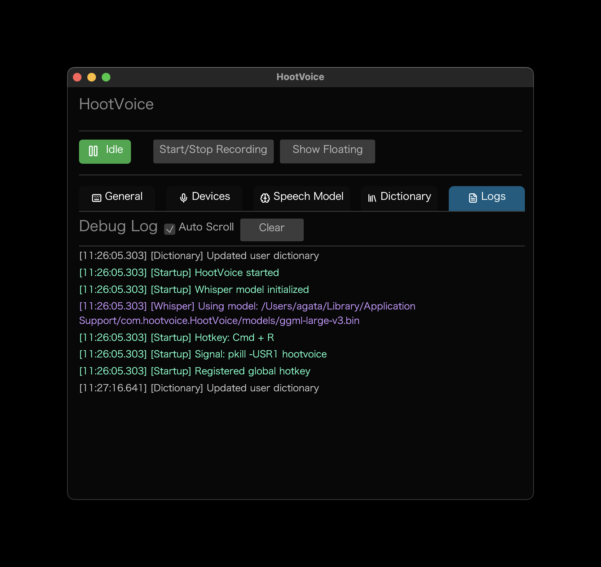
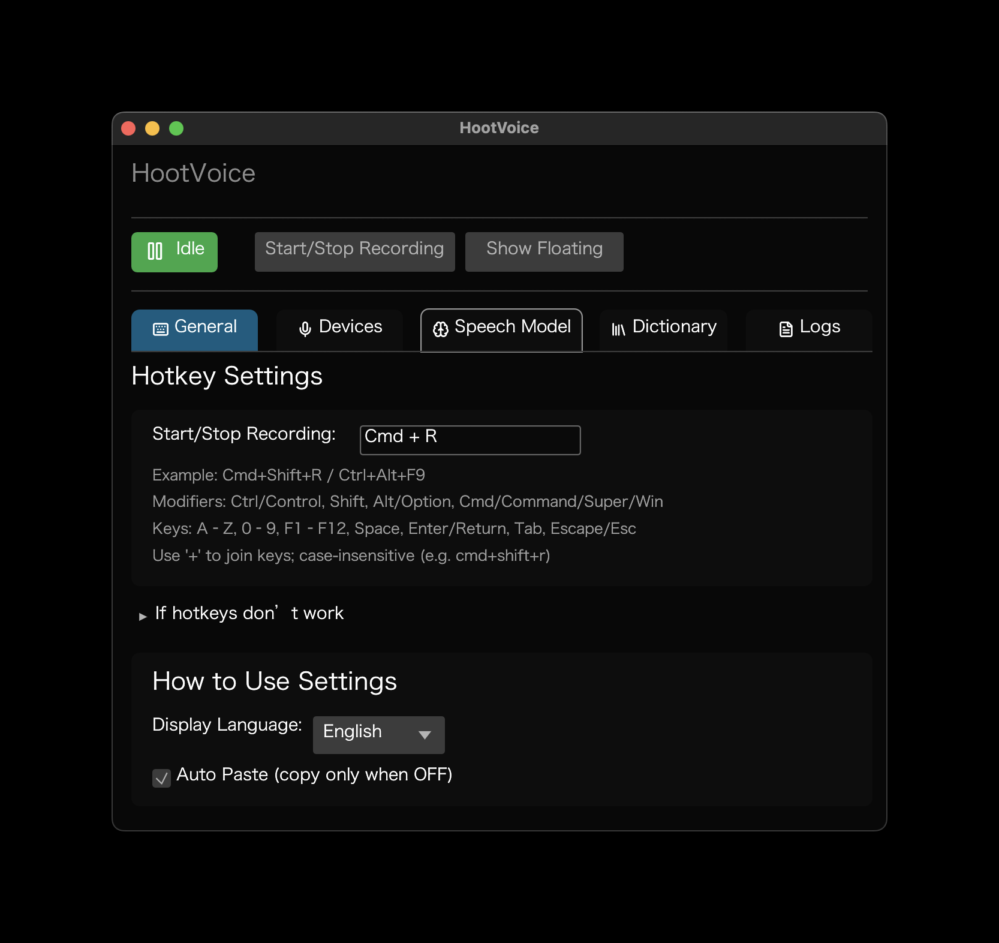
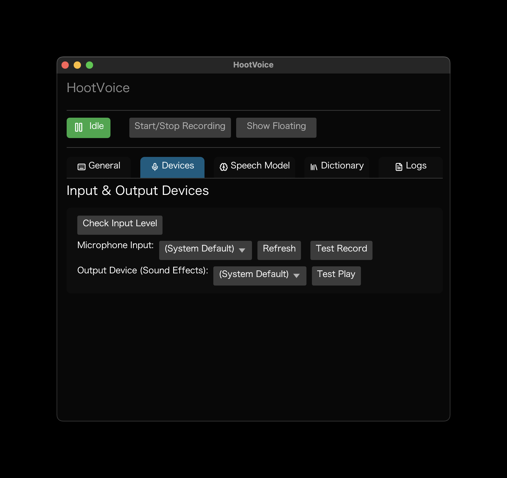
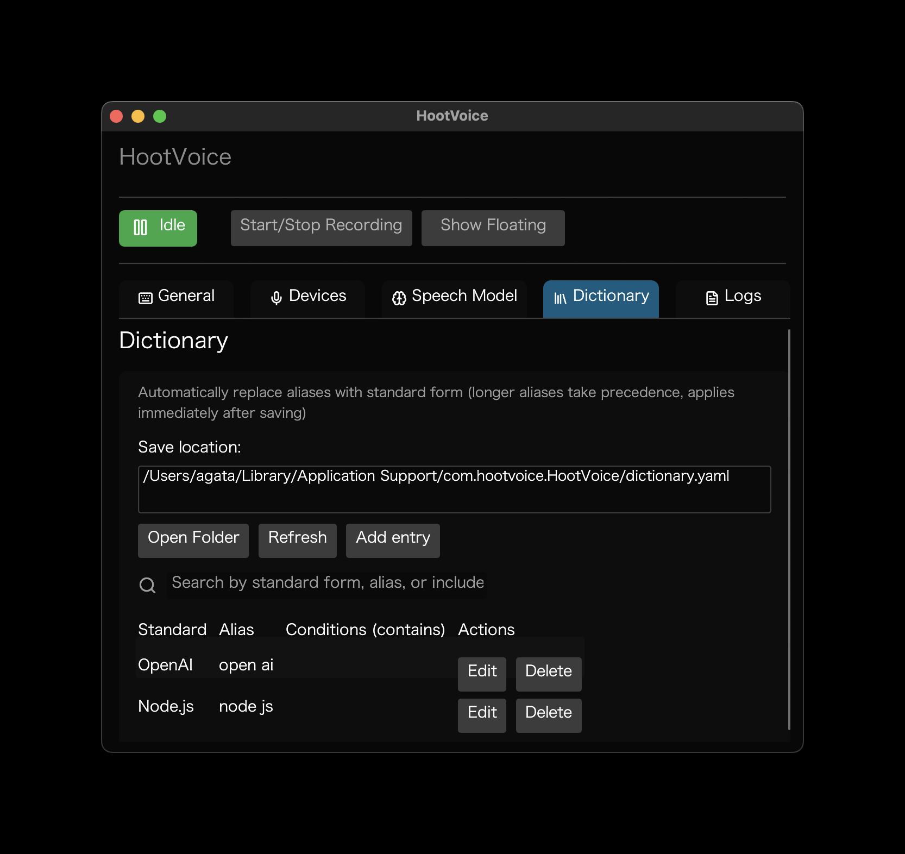
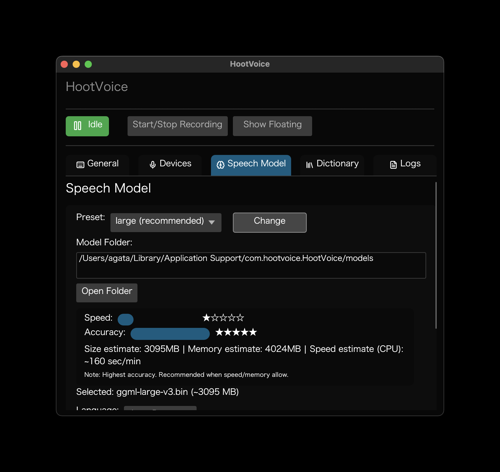
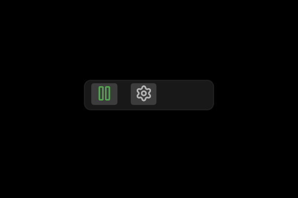

# HootVoice — 音声入力（Whisper）

HootVoice はマイク音声を録音し、Whisper でリアルタイムに文字起こしするクロスプラットフォームのアプリです。小さなフローティングツールバーと設定UIを備え、モデル管理（ダウンロード）、入出力デバイス設定、ユーザー辞書などを提供します。

利用者向けの手引きは [ユーザーマニュアル](docs/manual.ja.html) を参照してください（英語版は [User Manual](docs/manual.html)）。

## 特徴

- グローバルホットキーで録音トグル（既定: Ctrl+Shift+R／変更可）
- 高精度な文字起こし（whisper-rs、GPUアクセラレーション対応）
- 自動コピー／自動ペースト（前面アプリに貼り付け）
- クロスプラットフォーム（Linux / macOS / Windows）
- フローティングUI（Wayland は layer-shell サイドカー対応）
- モデル管理（公式 ggml モデルのダウンロード、進捗表示、ユーザーディレクトリ保管）
- ユーザー辞書（語句置換、文脈に応じて適用）
- 効果音（開始／処理中／完了、音量調整可能）
 - 完全ローカル: 端末内で完結（クラウド不要・API費用なし）

## スクリーンショット

<p align="center">
  <a href="docs/img/logs.png"></a>
  <a href="docs/img/settings.png"></a>
  <a href="docs/img/devices.png"></a>
</p>

<p align="center">
  <a href="docs/img/dictionary.png"></a>
  <a href="docs/img/model.png"></a>
  <a href="docs/img/floating.png"></a>
</p>

## 要件

- Rust 1.70+、C/C++ ビルド環境
- マイク入力、4GB+ メモリ（8GB 推奨）

プラットフォーム別の注意:
- Linux
  - オーディオ: `libasound2-dev`（ALSA）
  - クリップボード/自動ペースト: Wayland → `wl-clipboard` + `wtype`、X11 → `xclip` + `xdotool`
  - コピーのみ: `xclip` (X11) または `wl-copy` (Wayland) が必要
  - 本物のフローティング（任意、`wayland_layer` 機能）: GTK4 + `gtk4-layer-shell`
  - GPU(Vulkan) ビルド/実行用（whisper-rs）:
    - Ubuntu 24.04: `sudo apt install glslc libvulkan-dev vulkan-tools mesa-vulkan-drivers libopenblas-dev`
    - Arch: `vulkan-headers vulkan-icd-loader vulkan-radeon（または nvidia-utils） vulkan-tools`（+ `openblas` は任意）
- macOS
  - Xcode Command Line Tools（`xcode-select --install`）、10.15 以降
  - 自動ペーストはアクセシビリティ権限が必要（後述）
- Windows
  - Visual Studio Build Tools（C++）、Windows 10/11
  - GPU ビルドには Vulkan SDK を推奨

## ビルド

```bash
git clone https://github.com/agata/hootvoice.git
cd hootvoice
cargo build --release

# Wayland の layer-shell フローティング（サイドカー hootvoice-float）を有効化
cargo build --release --features wayland_layer --bins
```

バイナリの場所:
- Linux/macOS: `target/release/hootvoice`
- Windows: `target/release/hootvoice.exe`
- Wayland サイドカー: `target/release/hootvoice-float`（`wayland_layer` 有効時）

メモ（Linux）: `whisper-rs` の `vulkan` 機能を有効化するとシェーダコンパイラ `glslc` が必要です。Ubuntu 24.04 では `glslc libvulkan-dev vulkan-tools mesa-vulkan-drivers libopenblas-dev` を導入してください。

## ローカル処理（クラウド不要）

HootVoice は音声認識を端末上（ローカル）で実行します。音声データを外部サーバへ送信しません。

- プライバシー: 会議内容や機密情報が外部へ出ません。
- 速度: ネットワーク遅延の影響を受けず、CPU/GPU とモデルサイズに応じて高速に動作。
- コスト: API の従量課金は不要（無料）。
- ネットワーク利用: 初回のモデルダウンロード時のみ通信します。オフライン利用は、事前に `models/` に ggml モデルを配置してください。

## 実行

```bash
./target/release/hootvoice
```

初回起動時、選択した Whisper モデルがユーザー設定ディレクトリに自動ダウンロードされます（既定: Large‑v3 約 3.1GB）。モデルは「設定 → 音声モデル」で変更できます。ダウンロード先は設定ディレクトリ配下の `models/` です。

操作:
- トグル: グローバルホットキー（既定 Ctrl+Shift+R。設定で変更可）
- シグナル（Linux/macOS）: `SIGUSR1` で録音トグル、`SIGUSR2` で設定表示

## アプリデータ

ユーザーごとの保存場所:
- Linux: `~/.config/HootVoice`
- macOS: `~/Library/Application Support/HootVoice`
- Windows: `%APPDATA%\HootVoice`

主な内容:
- `settings.toml`: UI 設定（ホットキー、デバイス、言語、動作）
- `config.toml`: 互換用（`whisper.model_path` を保持）
- `models/`: ダウンロード済み ggml モデル（`ggml-*.bin`）
- `dictionary.yaml`: ユーザー辞書（設定 → 辞書 から編集）

## パッケージング

ローカル配布物の作成:

```bash
./build.sh
```

出力は `dist/`（およびプロジェクト直下のアーカイブ）に生成されます。Linux は AppImage（ツールがあれば）を、macOS は `.app` / DMG（ツールがあれば）を生成します。

Just タスク:

```bash
just clean   # cargo clean
just run     # cargo run
just build   # ./build.sh
just package # dist → artifacts にバージョン付きアーカイブ
```

## Wayland（Hyprland）

`wayland_layer` 機能を有効にすると、layer‑shell のミニツールバー用サイドカー（`hootvoice-float`）を起動します。Hyprland のルールで、設定ウィンドウを special workspace に、ツールバーを常時前面に固定する運用が可能です。

任意: 16〜24px の PNG アイコンを用意し、`HOOTVOICE_ICON_DIR` にフォルダを指定（`record.png` / `stop.png` / `loader.png` / `settings.png` / `grip-vertical.png`）。

## Waybar（カスタムモジュール例）

HootVoice は「設定ファイルと同じディレクトリ」直下に `status.json` を出力します（OS 標準の設定ディレクトリ。例: Linux は `~/.config/HootVoice/status.json`）。Waybar の custom モジュールで表示・操作できます。

Waybar 設定例（`~/.config/waybar/config`）:

```json
{
  "custom/hootvoice": {
    "return-type": "json",
    "interval": 1,
    "exec": "cat ~/.config/HootVoice/status.json || echo '{\"text\":\"○\",\"tooltip\":\"idle\",\"class\":\"idle\",\"alt\":\"idle\",\"color\":\"#22aa22\"}'",
    "on-click": "pkill -USR1 hootvoice",
    "on-click-right": "pkill -USR2 hootvoice"
  }
}
```

Waybar のスタイル例（`~/.config/waybar/style.css`）:

```css
#custom-hootvoice.idle { color: #22aa22; }
#custom-hootvoice.recording { color: #dd3333; }
#custom-hootvoice.processing { color: #d0c000; }
```

メモ:
- 左クリックで録音トグル（SIGUSR1）、右クリックで設定表示（SIGUSR2）
- JSON の `text`/`tooltip`/`class`/`alt`/`color` は HootVoice 側で出力されます

## トラブルシューティング

- Vulkan ビルドエラー（Linux）: `glslc libvulkan-dev vulkan-tools mesa-vulkan-drivers` を導入。GPU ドライバも確認。
- 自動ペースト（macOS）: システム設定 → プライバシーとセキュリティ で “HootVoice” にアクセシビリティとオートメーション（System Events）を許可。ブロック時はアプリのログにヒントが出ます。
- 自動ペースト（Linux）: Wayland は `wtype`、X11 は `xdotool` を導入。未導入時はコピーのみになります。
- マイクが見えない: `aplay -l` / `arecord -l` で確認。オーディオサーバの稼働を確認。

## ライセンス

MIT

## サードパーティライセンス

アプリには `assets/THIRD_PARTY_LICENSES.md`（`cargo-about` で生成）が同梱され、設定画面から参照できます。

## Whisper モデルのライセンス

HootVoice は利用時に Whisper の ggml モデルをダウンロードします。Whisper（および利用している ggml 変換版）は OpenAI によって MIT License で提供されています。再配布を行う場合などは、[Whisper リポジトリ](https://github.com/openai/whisper#license) に記載された条件をご確認ください。

## 貢献

PR を歓迎します。大きな変更は事前に issue でご相談ください。

## 謝辞

- OpenAI Whisper
- whisper.cpp / whisper‑rs
